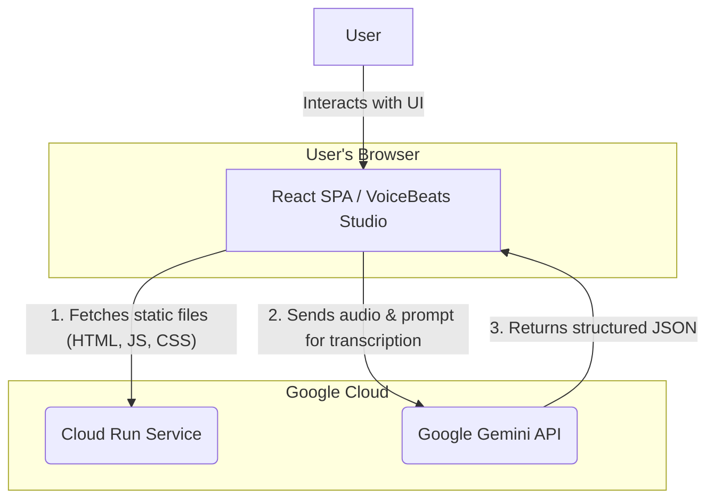
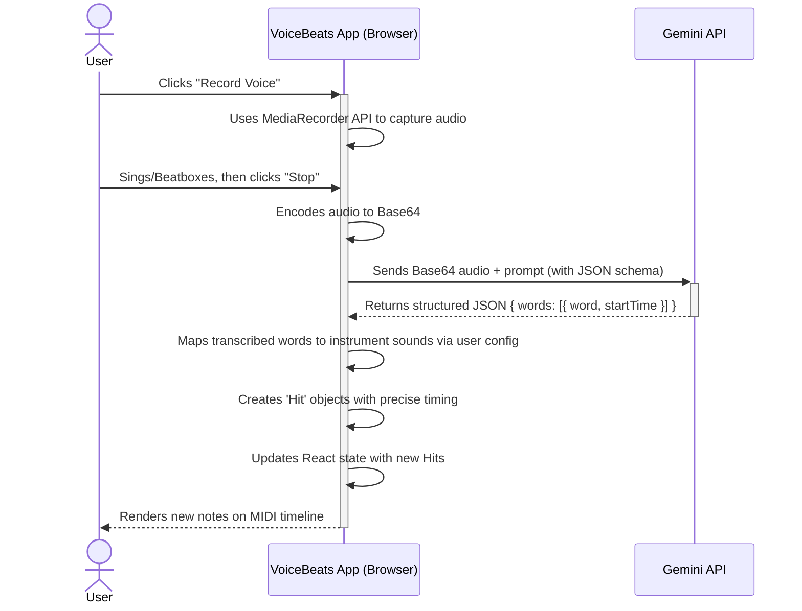

# Project Architecture: VoiceBeats Studio

This document provides a high-level overview of the technical architecture for VoiceBeats Studio, a browser-based, AI-powered music creation tool.

## 1. System Overview

VoiceBeats Studio is a **client-side Single Page Application (SPA)** built with React and TypeScript. It functions entirely within the user's web browser, leveraging the Google Gemini API as its backend for intelligent audio processing. The application is designed to be stateless from a server's perspective, making it an ideal candidate for serverless hosting environments like Google Cloud Run.

### High-Level Architecture Diagram

---

## 2. Component Breakdown

### Client-Side Application (React SPA)

This is the core of the application that the user interacts with.

-   **Frameworks & Libraries**:
    -   **React**: For building the user interface.
    -   **TypeScript**: For type safety and code maintainability.
    -   **Tailwind CSS**: For styling the application.
    -   **@google/genai**: The official SDK for interacting with the Gemini API.

-   **Key Modules**:
    -   `App.tsx`: The root component that manages global state (tracks, BPM, playback state) and orchestrates interactions between child components.
    -   `components/VoiceMapping.tsx`: Handles all user audio input (recording via Web Audio API, file uploads) and communication with the Gemini API for transcription.
    -   `components/MidiEditor.tsx`: The interactive multi-track sequencer UI. It renders drum hits and melodic notes (piano roll) and manages user interactions like adding, moving, resizing, and deleting notes.
    -   `synth.ts`: A collection of functions using the **Web Audio API** to generate all instrument sounds synthetically in real-time within the browser. No audio samples are used.
    -   `midi.ts`: Contains the logic to convert the application's internal state (tracks and hits) into a binary `.mid` file for export.

### External Services

-   **Google Gemini API**: This serves as the "brains" of the application.
    -   **Model**: `gemini-2.5-flash` is used for its multimodal capabilities and fast response times.
    -   **Function**: It receives raw audio data from the client and a specific prompt. It performs audio transcription, identifying individual words (beatbox sounds or sung syllables) and returns a structured JSON object containing each word and its precise start time. This structured output is critical for accurately placing notes on the timeline.

### Hosting & Deployment (Google Cloud Run)

The application is deployed as a containerized web service.

-   **Containerization**: The project is packaged into a **Docker container**. This container includes:
    1.  The compiled, static frontend assets (`index.html`, bundled JavaScript, CSS).
    2.  A lightweight, production-grade web server (like **NGINX** or **Caddy**) configured to serve these static files.

-   **Cloud Run**: This fully managed, serverless platform runs the container.
    -   **Why Cloud Run?**:
        -   **Stateless**: A perfect match for our frontend-only application.
        -   **Scales to Zero**: Cost-effective, as it doesn't run when there are no users.
        -   **Simple Deployment**: Easy to deploy directly from a container image.
        -   **Managed Infrastructure**: Google handles all the underlying infrastructure, scaling, and security.

---

## 3. Data Flow: Voice-to-MIDI Process

The primary data flow involves turning a user's vocal performance into MIDI data on the timeline.

---

## 4. State Management

-   **Application State**: All dynamic state (the contents of each track, BPM, current playback position, etc.) is managed within the browser by React's built-in hooks (`useState`, `useRef`, `useMemo`).
-   **Session Persistence**: To provide a seamless user experience, the entire multi-track composition (`tracks` array) is saved to the browser's **`localStorage`**. This allows users to close their browser and resume their work later.

## 5. Configuration

-   **API Key**: The Google Gemini API key is the sole external configuration required. It is expected to be provided as an environment variable (`process.env.API_KEY`) to the application at runtime. On Cloud Run, this can be securely injected as a runtime environment variable into the container, although a build-time injection mechanism is required to make it accessible to the client-side code.
